# Schema Generator: Automated Generation and Evaluation of Data Dictionaries and Schema Matching with LLMs

> **Technical/scientific article for the `schema_generator` project.**
> Documents the architecture, processes, sequences, APIs/interfaces, usage, and the
> benchmark results obtained on the BIRD Mini-Dev corpus.
> Generated June 2026. Diagrams in Mermaid (exported to PNG) and charts in matplotlib are
> embedded throughout. (Portuguese version: [`SCHEMA_GENERATOR_ARTICLE.md`](SCHEMA_GENERATOR_ARTICLE.md).)

---

## Abstract

Integrating data between normalized relational models (3NF) and multidimensional analytical
models (*star schema*) requires aligning schemas that often use different names, types, and
structures for equivalent concepts. This alignment — *schema matching* — is traditionally
manual, costly, and error-prone. This work presents **`schema_generator`**, a modular,
prompt-driven framework that automates two related tasks: **(i)** generating semantic **data
dictionaries** from statistical profiles and table samples, using multiple *Large Language
Models* (LLMs); and **(ii)** ***schema matching*** between relational models and *star
schemas*. The quality of the generated dictionaries is evaluated quantitatively via **cosine
similarity** between *embeddings* of generated descriptions and reference descriptions.

The empirical evaluation was run on **BIRD Mini-Dev** (11 SQLite databases, 75 tables, 798
reference fields), comparing **6 LLMs** (DeepSeek, Google Gemini, and OpenAI) across **4,701
field-by-field comparisons**. The central result is the **LLM quality ranking**:
`deepseek-v4-flash` is the most consistent winner in the per-table head-to-head — it produces
the best dictionary in **30 of 75 tables** under BGE (and 25/75 under the alternative MiniLM
instrument) — while `gpt-5.4-nano` (the smallest/cheapest) is the worst by global mean under
both rulers. The four middle models are in a technical tie, and *their mean ranking* **does
depend** on the embedding model used as the measurement instrument — hence the recommendation
rests on the head-to-head metric (Figure 9), which is stable across both rulers, rather than
on the global mean.

---

## 1. Introduction and Motivation

Migrating transactional (normalized) data into analytical (denormalized, *star schema*)
environments is a recurring problem in data engineering. The core challenge is *schema
matching*: mapping source fields to target fields when:

- multiple normalized tables must map to denormalized fact and dimension tables;
- complex transformations (aggregations, type conversions, concatenations, derived fields)
  must be detected and documented;
- correspondence is **semantic**, not merely lexical — business names and meanings diverge
  between operational and analytical models.

`schema_generator` attacks this problem with a **prompt-driven** approach: LLMs are guided by
detailed instructions to **(a)** semantically describe each table and field (data dictionary)
and **(b)** produce auditable source → target mappings, including the required transformations
and full coverage of target fields (supporting 1→N, N→1, and composite mappings).

The input given to the LLMs is not raw data, but **statistical profiles** (types, counts,
nulls, distributions) and representative **samples** — a choice that reduces token volume and
focuses the model on field meaning.

---

## 2. System Architecture

The system is organized into decoupled layers, each materialized by a script in `src/` and
orchestrated by `run.py`. Figure 1 shows the component view.

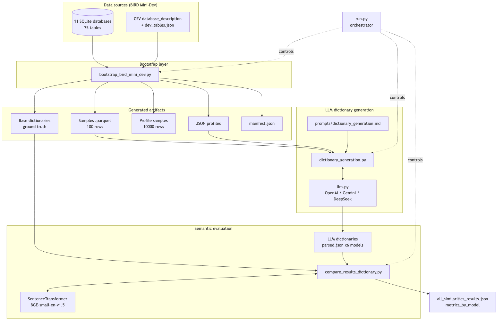
**Figure 1.** Component architecture. The BIRD sources (SQLite + CSV) are transformed by the
bootstrap layer into artifacts (base dictionaries, samples, profiles, manifest); the
generation layer uses LLMs to enrich dictionaries; the evaluation layer compares the result
against the ground truth via embeddings. `run.py` orchestrates every step.

### 2.1 Main components (`src/`)

| Module | Responsibility | Input → Output |
| --- | --- | --- |
| `bootstrap_bird_mini_dev.py` | Downloads/extracts BIRD Mini-Dev, introspects SQLite, reads description CSVs, and generates base dictionaries, samples, profiles, and `manifest.json`. | `minidev.zip` / SQLite → artifacts in `data/bird_mini_dev/` |
| `samples.py` | Generates random samples (100/1,000/10,000 rows) from Parquet files, with strategies adapted to file size. | full Parquet → `data/samples/*.parquet` |
| `profilling.py` | Uses the `dataprofiler` library to generate JSON statistical profiles. | samples → `data/profiles/*.json` |
| `dictionary_generation.py` | Builds the prompt (profile + sample) and triggers the LLMs to generate dictionaries, validating against a Pydantic schema. | profiles + samples + prompt → `data/llm_results/.../*_parsed.json` |
| `schema_matching_generation.py` | Generates the source→target mapping (relational → star schema) via a dedicated prompt. | source dictionary + target model → `data/schema_matching/` |
| `compare_results_dictionary.py` | Computes embeddings and cosine similarity between LLM and reference dictionaries; consolidates distribution metrics. | LLM + reference dictionaries → `data/distance_calculation/` |
| `llm.py` | Unified LLM client (OpenAI, Gemini, DeepSeek): auth, structured output, async concurrency, persistence. | used by the generation modules |
| `load_data.py` | Loads Parquet samples into DuckDB and generates DDL/verification scripts. | Parquet → DuckDB + `.sql` |

### 2.2 Configuration and interfaces

The system is **configuration-driven**, with no hard-coded paths or models:

- **`config.yaml`** — paths to profiles, dictionaries, samples, the target model, output
  directories, the schema-matching LLM selection, and the **`embedding:`** block (embedding
  model, device, cache, normalization, batch size).
- **`.env`** — API keys and the definition of LLM targets via the pattern
  `LLM_CLIENTS=<id1>,<id2>,...` and `LLM_<ID>_*` variables (provider, model, base URL,
  structured-output flags). Multiple targets — combining providers, models, and keys — can be
  run in a single pass.

---

## 3. The Pipeline Processes

`run.py` is the **single entry point**. Each subcommand wraps a `src/*.py` script as a
subprocess, so failures propagate as exit codes and compose naturally with `set -e` and CI.
Figure 2 shows the control flow.

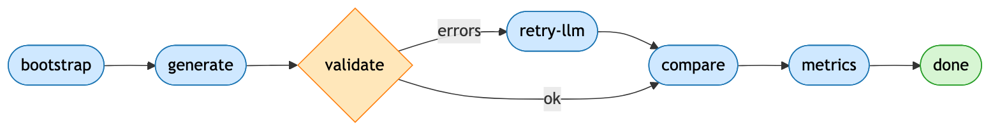
**Figure 2.** Pipeline flow. `validate` is a gate: if errors exist, `retry-llm` reruns only
the provider/profile combinations that failed before `compare`.

| Subcommand | Wraps | Purpose |
| --- | --- | --- |
| `bootstrap` | `bootstrap_bird_mini_dev.py` | Downloads/processes BIRD Mini-Dev and generates artifacts. |
| `generate` | `dictionary_generation.py` | Generates the LLM dictionaries for each profile. |
| `validate` | in-process audit | Inspects every `*_parsed.json` for errors. |
| `retry-llm` | `dictionary_generation.py` | Reruns only combinations whose JSON is missing/invalid. |
| `compare` | `compare_results_dictionary.py` | Computes cosine distances and writes the summaries. |
| `metrics` | in-process read | Prints the consolidated `metrics_by_model` summary. |
| `all` | validate → (retry) → compare | Post-generation convenience. |
| `pipeline` | bootstrap → generate → all | Full end-to-end pipeline. |

```bash
# Full pipeline: bootstrap + generate + validate + retry-llm + compare
uv run python run.py pipeline --with-bootstrap --with-generate --with-retry
```

### 3.1 Process 1 — Benchmark bootstrap

`bootstrap_bird_mini_dev.py` makes the pipeline reproducible from a public dataset. It:
locates/downloads `minidev.zip`; scans `dev_databases/*/*.sqlite`; uses `PRAGMA table_info` to
enumerate columns (with PK/FK/not-null); reads the `database_description` CSVs (with encoding
fallback `utf-8-sig`→`utf-8`→`cp1252`→`latin-1`); and infers **`domain_values`** for
low-cardinality columns (≤ 30 distinct and ratio ≤ 0.2). The result is a **base dictionary**
per table (which serves as ground truth), prompt samples (100 rows), profiling samples
(10,000 rows), compact profiles, and a consolidated `manifest.json`. With `--update-config`,
the `config.yaml` lists are rewritten to point at these artifacts automatically.

### 3.2 Process 2 — Sampling and profiling

`samples.py` adopts three strategies depending on file size (direct sampling for small files;
sparse index-based sampling for files > 10M rows; fractional sampling with exact trim for the
intermediate ones), ensuring reproducibility via `random_state`. `profilling.py` uses
`dataprofiler` (`Profiler(...).report(output_format="compact")`) to produce the JSON profiles
that feed the prompt.

### 3.3 Process 3 — LLM dictionary generation

The heart of generation lives in `dictionary_generation.py` + `llm.py`. The prompt
(`prompts/dictionary_generation.md`) instructs the LLM to act as a modeling and documentation
expert, receiving two blocks — **`## Data Profile`** (statistics) and **`## Data Sample`** (a
markdown-table sample) — and to return **only** a valid JSON with `table_name`,
`table_description` and, per field, `field_name`, `data_type`, `field_description`,
`example_value`, `domain_values` (optional), and `full_description` (the description +
domain/example concatenation, used later in the comparison).

Figure 3 details the sequence. The output is validated against the Pydantic model
`DataDictionary` (`extra="forbid"`), and three artifacts are persisted per model
(`*_raw.txt`, `*_parsed.json`, `*_prompt.txt`) for auditability and reproducibility.

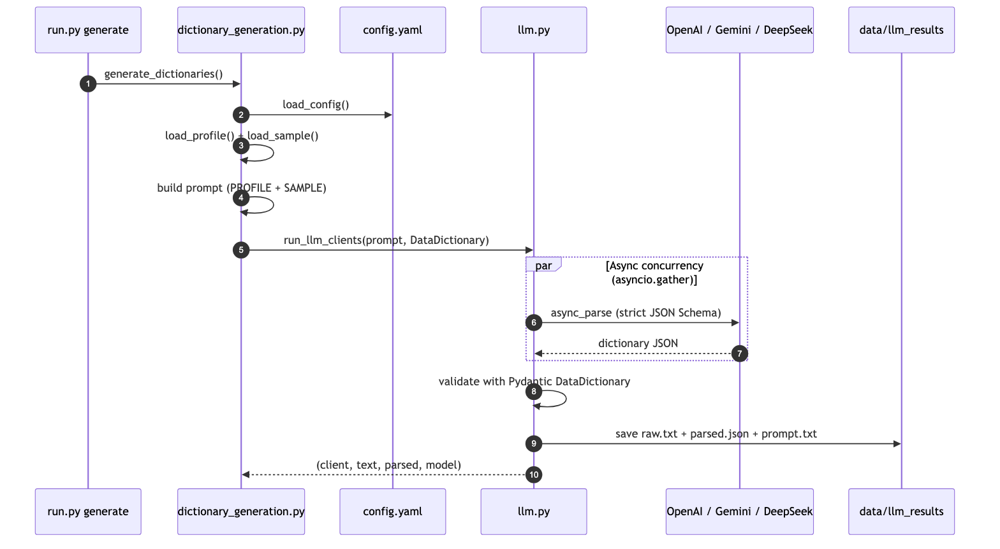
**Figure 3.** Generation sequence. The clients are initialized and invoked **concurrently**
(`asyncio.gather`); each response is schema-validated before being saved.

### 3.4 Process 4 — Schema matching

`schema_matching_generation.py` receives the source schema (a JSON dictionary, possibly
enriched) and the target *star schema*, and instructs the LLM to: compare
names/types/descriptions; exploit synonyms, abbreviations, business context, and PK/FK
metadata; **detect and document transformations** (conversions, aggregations, concatenations);
and **ensure full coverage** of target fields (even without a match, supporting 1→N, N→1, and
composite mappings). The output is a strict JSON per target table/field.

### 3.5 Process 5 — Semantic similarity evaluation

`compare_results_dictionary.py` quantifies quality. For each common key
`(table, model, field)`, it computes embeddings of the `full_description` from the LLM
dictionary and the reference dictionary (`SentenceTransformer.encode`) and the **cosine
similarity** (`sklearn.metrics.pairwise.cosine_similarity`). Files with an `error` key
(rate-limit/parse failures) are skipped. The consolidated result in
`all_similarities_results.json` has three blocks:

- `results` — score per `(table, field, model)` (the raw distribution — 4,701 values);
- `metrics_by_table_and_model` — distribution metrics per `(table, model)`;
- `metrics_by_model` — metrics per model, aggregating all tables.

The metrics reported by `compute_similarity_metrics` are: `mean`, `std` (sample, ddof=1),
`q25`, `median`, `q75`, `d90`, `d99`, `min`, `max`, `count` (non-finite values are dropped).
Figure 4 shows the sequence.

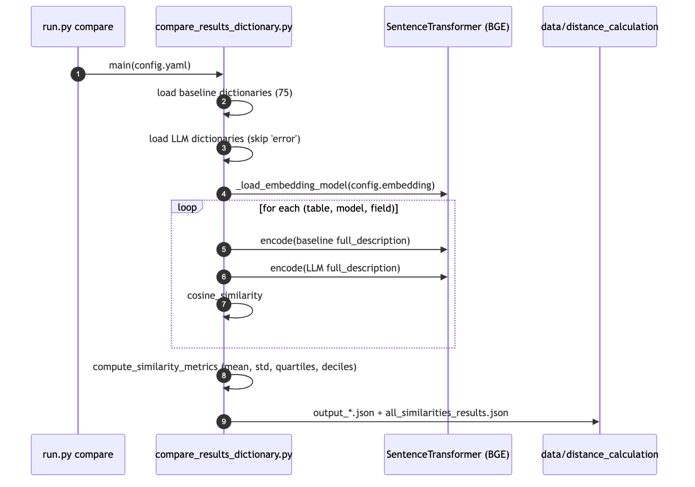
**Figure 4.** Comparison sequence. The embedding model is built by
`_load_embedding_model(config)` from the `embedding:` block of `config.yaml`.

---

## 4. APIs, Interfaces, and the Unified LLM Client

`llm.py` abstracts three providers behind a common interface. Figure 5 summarizes the
hierarchy.

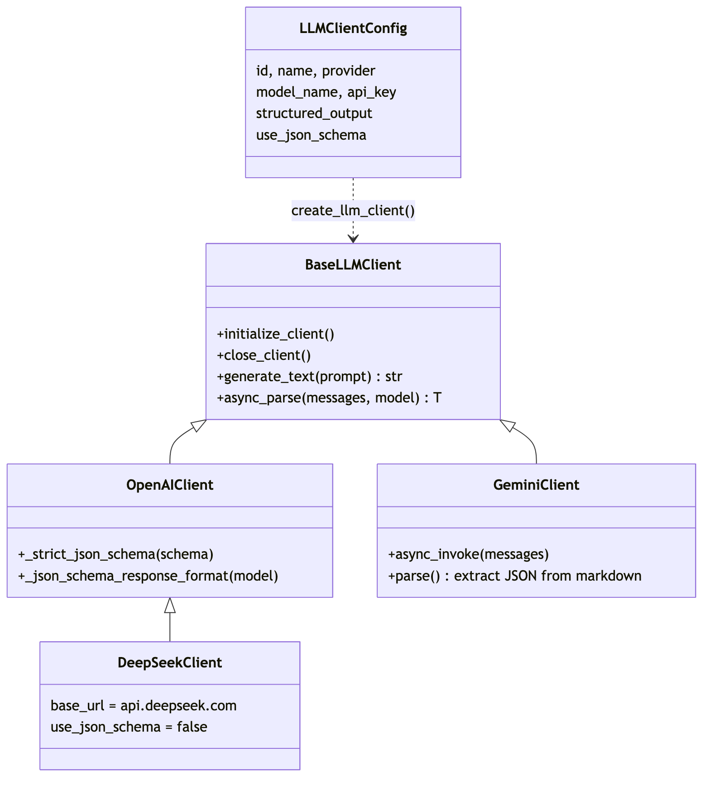
**Figure 5.** `BaseLLMClient` defines the contract; `OpenAIClient` implements structured
output via strict JSON Schema; `DeepSeekClient` inherits from `OpenAIClient` (JSON-object
mode, no strict schema); `GeminiClient` uses Gemini's OpenAI-compatible endpoint and extracts
JSON from markdown blocks when needed.

**Key design points:**

- **Environment-driven configuration:** `load_llm_client_configs()` reads `LLM_CLIENTS` and
  the `LLM_<ID>_*` variables, with a fallback to legacy mode (`OPENAI_API_KEY`,
  `GEMINI_API_KEY`, `DEEPSEEK_API_KEY`). Each `LLMClientConfig` is immutable and carries
  `provider`, `model_name`, `structured_output`, `use_json_schema`, etc.
- **Per-provider structured output:** OpenAI and Gemini can require strict JSON Schema
  (`_strict_json_schema` makes all properties required and forbids extra properties); DeepSeek
  runs in JSON-object mode with a schema hint in the prompt.
- **Async concurrency:** client initialization, processing, and shutdown are parallelized via
  `asyncio.gather`, allowing the 6 models to run side by side.
- **Persistence and resilience:** `save_response_data` writes `raw/`, `json/`, and `prompts/`;
  an emergency backup fallback exists in `logs/emergency_backups/`.

The public functions are `run_llm_clients(prompt, base_output_dir, response_model)`,
`run_llm_clients_one(...)` (single client, used in retry), and
`load_llm_client_configs(selected)`.

### 4.1 Artifact flow

Figure 6 shows how artifacts flow between directories. Note that the reference dictionaries
can come from BIRD (`data/bird_mini_dev/dictionaries/`) **or** from `docs/model_sources/` —
the pipeline is agnostic to the origin of the ground truth.

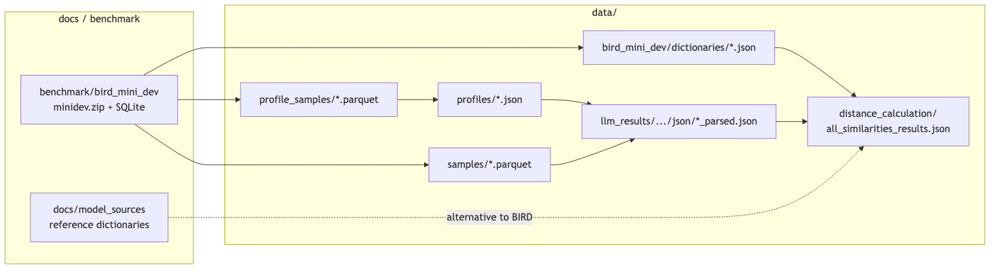
**Figure 6.** Data/artifact flow. Each arrow represents a produce/consume dependency between
steps.

---

## 5. How to Use

```bash
# 1. Dependencies (uv recommended)
uv sync

# 2. Configure secrets and paths
cp .env.example .env   # fill in API keys and LLM_CLIENTS
#   adjust config.yaml (paths, embedding: block, schema_matching_llm)

# 3a. Fast path: reproducible BIRD Mini-Dev benchmark
uv run python run.py bootstrap --update-config

# 3b. Or manual path with your own data
python src/samples.py        # samples of 100/1k/10k
python src/profilling.py     # JSON profiles

# 4. Dictionary generation (6 LLMs in parallel)
uv run python run.py generate

# 5. Audit + selective retry + comparison
uv run python run.py all --with-retry

# 6. Consolidated summary
uv run python run.py metrics
```

For schema matching: `python src/schema_matching_generation.py` (after configuring the target
model in `docs/model/model.json` and selecting `schema_matching_llm` in `config.yaml`).

---

## 6. Benchmark Experimental Setup

| Dimension | Value |
| --- | --- |
| Corpus | **BIRD Mini-Dev** |
| Databases | **11** (`california_schools`, `card_games`, `codebase_community`, `debit_card_specializing`, `european_football_2`, `financial`, `formula_1`, `student_club`, `superhero`, `thrombosis_prediction`, `toxicology`) |
| Tables (base dictionaries) | **75** |
| Reference fields | **798** |
| LLMs evaluated | **6**: `deepseek-v4-flash`, `deepseek-v4-pro`, `gemini-3.1-flash-lite`, `gemini-3.5-flash`, `gpt-5.4-mini`, `gpt-5.4-nano` |
| Field-by-field comparisons (BGE) | **4,701** keys `(table, model, field)` |
| Measurement instrument (default) | `BAAI/bge-small-en-v1.5` (384 dim, device `cpu`) |
| Baseline instrument | `all-MiniLM-L6-v2` (384 dim) |
| Metric | Cosine similarity between LLM `full_description` × reference |

> **Note on model identifiers.** The ids (`gpt-5.4-*`, `gemini-3.x`, `deepseek-v4-*`) and the
> date (2026) are the ones recorded by the project itself and reproduced here as-is; this
> article describes **what the project measured**, not an external model taxonomy.

### 6.1 Why 75 tables?

The number 75 is **not a sample or an arbitrary cut**: it is the **exhaustive count of every
table across the 11 databases** of BIRD Mini-Dev. In the bootstrap step (§3.1), the
`discover_tables()` function scans `dev_databases/*/*.sqlite`, runs `PRAGMA table_info` on each
database, and enumerates **all** tables (excluding the `sqlite_*` system tables). The sum is
75:

| SQLite database | Tables |
| --- | ---: |
| formula_1 | 13 |
| superhero | 10 |
| student_club | 8 |
| codebase_community | 8 |
| financial | 8 |
| european_football_2 | 7 |
| card_games | 6 |
| debit_card_specializing | 5 |
| toxicology | 4 |
| thrombosis_prediction | 3 |
| california_schools | 3 |
| **Total (11 databases)** | **75** |

The corpus chain is therefore: **11 databases → 75 tables → 798 reference fields**. The
`--sample-size` and bootstrap filters control only the **sample size** (rows per table), **not**
the number of tables; reducing the 75 would require restricting which databases/tables
`discover_tables()` processes.

### 6.2 Coverage and robustness

Of the **450** attempted generations (75 tables × 6 models), **442 were valid** and **8
failed** (report `reports/dictionary_generation_error_report.md`). The failures concentrate in
**3 large tables** (`european_football_2.match`, `codebase_community.posts`, and
`.posthistory`) and in **operational-limit categories**, not model quality:

| Error category | Occurrences |
| --- | --- |
| `openai_tpm_or_prompt_too_large` | 6 |
| `context_window_exceeded` | 1 |
| `provider_quota_exceeded` | 1 |

This explains why the per-model `count` varies (717–873): tables with more fields and/or
larger prompts sometimes exceed the tokens-per-minute (TPM) limit or the context window. The
`validate` + `retry-llm` gate in the pipeline is precisely the mechanism to mitigate this kind
of transient failure.

---

## 7. Results — Comparison Among the LLMs

The central object of the evaluation is the **6 language models**. The practical question is:
*which LLM generates data dictionaries semantically closest to the ground truth?* All results
in this section use the same measurement instrument (BGE), fixed so that the comparison is
between LLMs and not between rulers (see the methodological note in §7.5).

### 7.1 Quality ranking per LLM

Figure 7 ranks the models by mean cosine similarity (with 95% confidence interval), computed
over the 4,701 raw values in the `results` block.

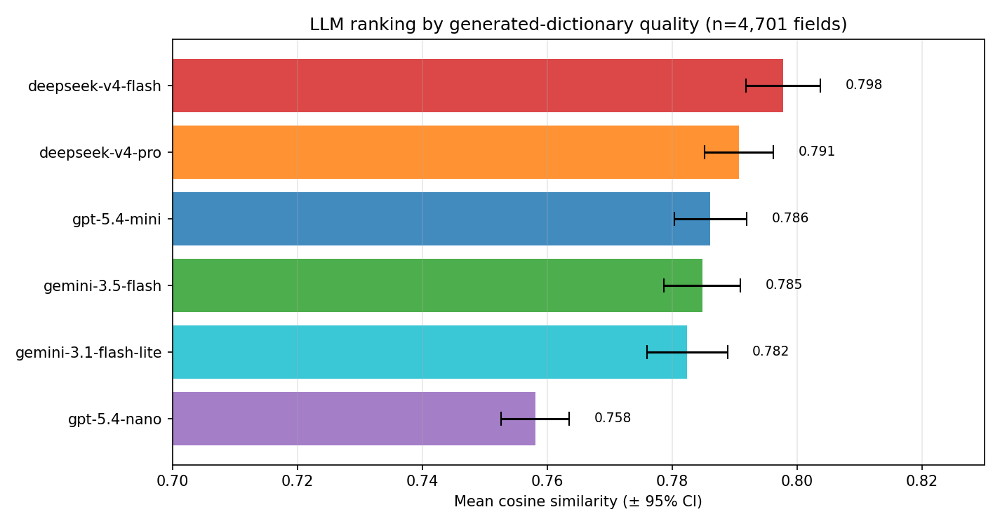
**Figure 7.** LLM ranking. `deepseek-v4-flash` leads (0.798); `gpt-5.4-nano` is last by a
clear margin (0.758). The four middle models are statistically close.

`metrics_by_model` (BGE instrument):

| Rank | Model | mean | std | median | d90 | d99 | min | max | n |
| ---: | --- | ---: | ---: | ---: | ---: | ---: | ---: | ---: | ---: |
| 1 | **deepseek-v4-flash** | **0.7978** | 0.0905 | 0.8079 | 0.9102 | 0.9801 | 0.5165 | 0.9930 | 873 |
| 2 | deepseek-v4-pro | 0.7907 | 0.0832 | 0.7996 | 0.8882 | 0.9728 | 0.5295 | 0.9931 | 873 |
| 3 | gpt-5.4-mini | 0.7862 | 0.0787 | 0.7940 | 0.8833 | 0.9430 | 0.5387 | 0.9632 | 717 |
| 4 | gemini-3.5-flash | 0.7849 | 0.0861 | 0.7932 | 0.8916 | 0.9501 | 0.5350 | 0.9939 | 756 |
| 5 | gemini-3.1-flash-lite | 0.7824 | 0.0907 | 0.7865 | 0.8990 | 0.9698 | 0.5163 | 0.9930 | 757 |
| 6 | gpt-5.4-nano | 0.7581 | 0.0745 | 0.7661 | 0.8489 | 0.8956 | 0.5062 | 0.9298 | 725 |

**Reading:** the top (`deepseek-v4-flash`) and bottom (`gpt-5.4-nano`) are robust separations;
the four middle models (0.782–0.791) sit within ~1 CI of one another — a technical tie. The
*nano*, besides the lowest mean, has the lowest upper tail (d99 = 0.896, vs > 0.94 for all
others): even on the easiest fields it rarely reaches the near-perfect descriptions the others
achieve.

### 7.2 Field-by-field distribution

Figure 8 shows the full distribution per model. Medians are close; what differentiates the
LLMs is the **lower tail** — opaque-named fields that the smaller models describe poorly.

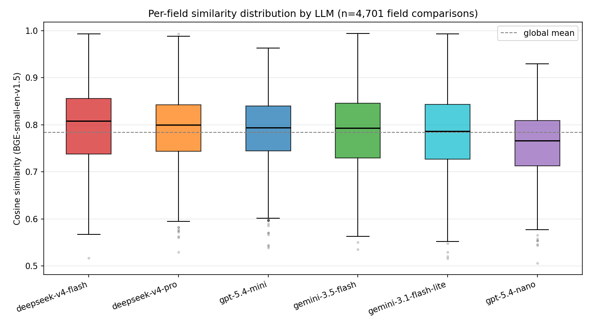
**Figure 8.** Field-by-field distribution per LLM (n = 4,701). `gpt-5.4-nano` has the lowest
box and the smallest upward spread; `deepseek-v4-flash` has the highest median and upper tail.

### 7.3 Per-table head-to-head (who wins where)

Aggregate means hide per-table variance. Figure 9 counts, for each of the 75 tables, **which
LLM produces the highest mean similarity** — a head-to-head comparison more robust to outliers
than the global mean.

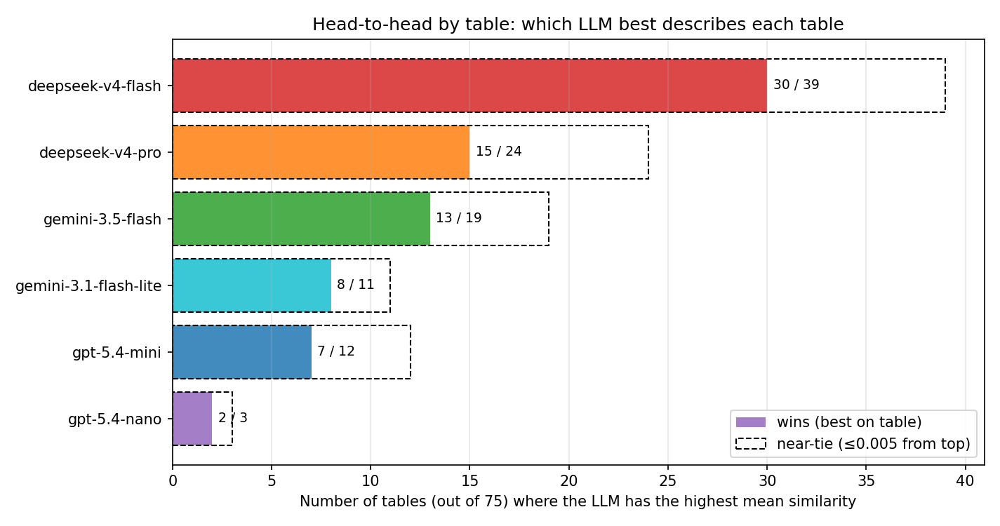
**Figure 9.** Number of tables (out of 75) where each LLM is the best. The dashed line counts
near-ties (within ≤ 0.005 of the top). `deepseek-v4-flash` wins **30/75** tables (and is in
the near-tie for 39); `gpt-5.4-nano` wins only **2**.

| Model | Wins (out of 75) | Near-ties (≤0.005 from top) |
| --- | ---: | ---: |
| **deepseek-v4-flash** | **30** | 39 |
| deepseek-v4-pro | 15 | 24 |
| gemini-3.5-flash | 13 | 19 |
| gemini-3.1-flash-lite | 8 | 11 |
| gpt-5.4-mini | 7 | 12 |
| gpt-5.4-nano | 2 | 3 |

This per-table head-to-head **confirms and reinforces** the main signal: `deepseek-v4-flash`
is the dominant winner (winning 40% of tables, more than twice the runner-up). Here the
separation between the leader and the middle pack is **sharper** than in the global mean —
evidence that `deepseek-v4-flash` is the most consistent choice for this task. The `nano` is
worst by global mean, though it does win a few tables head-to-head (2 under BGE); its weak
spot is the mean, not each table individually.

### 7.4 Per-database view

Figure 10 details mean similarity per database × LLM, revealing that difficulty is more a
function of the **domain/table** than of the model: databases with more opaque naming yield
lower means across all LLMs.

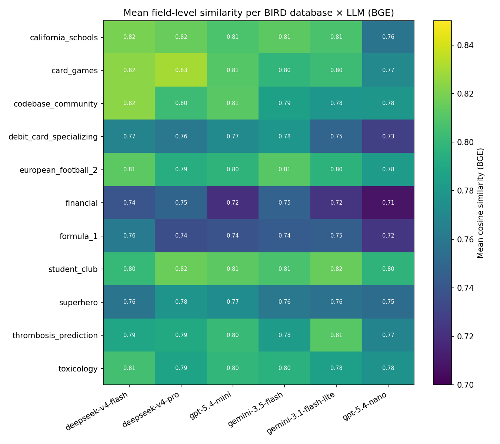
**Figure 10.** Mean similarity per BIRD database × LLM. The **vertical** variation (across
databases) rivals the **horizontal** (across models): the data domain is a difficulty factor
as important as the LLM choice. Even so, within each database the `deepseek-v4-flash` column
tends to be the brightest (highest similarity).

### 7.5 Cost and cost-benefit analysis

Quality alone does not decide the production choice: **execution cost** is the other axis. The
table below crosses the cost (USD) to generate the 75-table dictionaries, per model, with
quality (BGE mean) and per-table head-to-head wins (§7.3). The cost-benefit metric used is
**wins per dollar** (`wins ÷ cost`), which folds head-to-head quality and price into a single
reading.

| Model | Cost (US$) | BGE mean | Wins (out of 75) | **Wins / US$** |
| --- | ---: | ---: | ---: | ---: |
| **deepseek-v4-flash** | 0.270 | **0.7978** | **30** | **111.1** |
| deepseek-v4-pro | 0.860 | 0.7907 | 15 | 17.4 |
| gemini-3.1-flash-lite | 0.504 | 0.7824 | 8 | 15.9 |
| gpt-5.4-nano | **0.226** | 0.7581 | 2 | 8.8 |
| gpt-5.4-mini | 0.896 | 0.7862 | 7 | 7.8 |
| gemini-3.5-flash | **4.020** | 0.7849 | 13 | 3.2 |

Figure 11 places each model in the **cost × quality** plane (cost axis on a log scale).

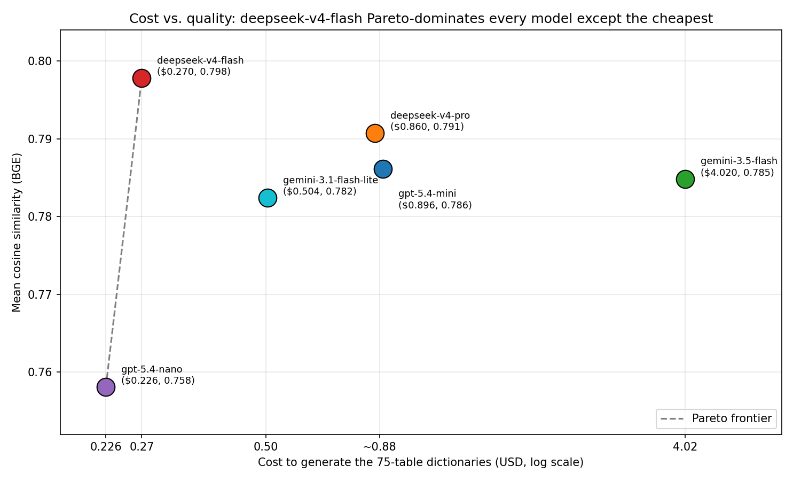
**Figure 11.** Cost (US$, log) vs. mean similarity (BGE). The dashed line is the **Pareto
frontier**. `deepseek-v4-flash` sits in the ideal corner (highest quality, second-lowest
cost); `gemini-3.5-flash` sits in the bad corner (expensive and not the leader).

**Cost-benefit findings:**

1. **`deepseek-v4-flash` Pareto-dominates every model except the cheapest.** It has the
   **highest quality** (0.798) **and** the **second-lowest cost** (US$ 0.27) — so it dominates
   `deepseek-v4-pro`, `gpt-5.4-mini`, `gemini-3.5-flash`, and `gemini-3.1-flash-lite`, which
   are simultaneously **more expensive and worse**. The Pareto frontier has only two points:
   `gpt-5.4-nano` (cheapest) and `deepseek-v4-flash` (best).
2. **`gemini-3.5-flash` is the worst value by a wide margin.** It costs **US$ 4.02 — ~15×**
   `deepseek-v4-flash` — yet ranks 4th in mean quality and 3rd in wins. Its **3.2 wins/US$**
   is the lowest of all (Figure 12 makes this explicit).
3. **`gpt-5.4-nano` is the cheapest, but the discount does not pay off.** Saving US$ 0.044
   (~16%) versus `flash` costs **−0.040 in quality** and a drop from **30 → 2 wins**. It only
   makes sense if cost is absolutely critical and semantic quality is secondary.
4. **The DeepSeek family is the best cost-quality trade-off.** The `flash` is the rational
   default; the `pro` (17.4 wins/US$) is a distant second in efficiency, ahead of every OpenAI
   and Google model.

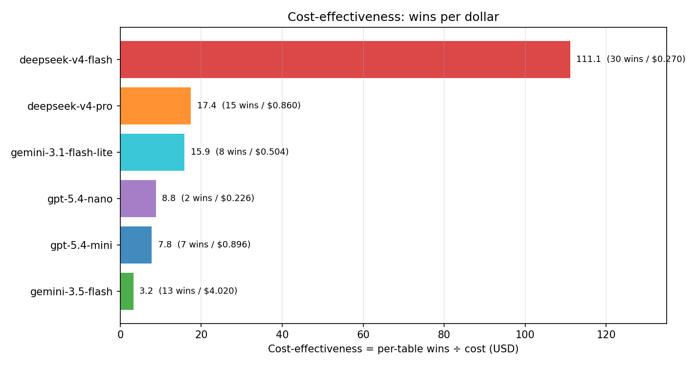
**Figure 12.** Cost-effectiveness = per-table wins ÷ cost (US$). `deepseek-v4-flash` (111.1)
is **~6×** more cost-effective than the runner-up and **~35×** more than `gemini-3.5-flash`.

> **Note on the cost unit.** The US$ values are the reported total cost for the 75-table
> generation pass per model. Since the pipeline is identical across models (same prompt, same
> profiles/samples), the **cost ratios between models** are what matter for the decision and
> are robust to the exact unit.

### 7.6 Methodological note — the measurement instrument

For completeness, the comparison above uses `BAAI/bge-small-en-v1.5` as the embedding. A
robustness study (detailed in `reports/EMBEDDING_MODEL.md`) repeated the measurement with
`all-MiniLM-L6-v2`. Two things change and two hold:

**What changes with the ruler:** the **absolute** values (BGE reports +0.16–0.19 in mean and
~50% lower std, since it is a different ruler) **and the mean ranking of the middle pack**. By
global mean, under MiniLM the leader is actually `gemini-3.5-flash` (0.6242), with
`deepseek-v4-flash` 2nd (0.6196) and `deepseek-v4-pro` dropping to 5th — i.e., the *mean*
ranking of the four middle models is **not** stable and one should **not** claim "the DeepSeek
family leads under both rulers."

**What holds (robust conclusions):**

1. **`gpt-5.4-nano` is the worst by global mean under both rulers** (BGE 0.758; MiniLM 0.570).
2. **`deepseek-v4-flash` wins the most tables in the head-to-head under both rulers** —
   **30/75 under BGE** and **25/75 under MiniLM**, in both cases with a clear margin over the
   runner-up (15). It is this *head-to-head* metric (Figure 9), not the global mean, that
   supports recommending `deepseek-v4-flash`.

| Model | Wins under BGE | Wins under MiniLM |
| --- | ---: | ---: |
| **deepseek-v4-flash** | **30** | **25** |
| deepseek-v4-pro | 15 | 15 |
| gemini-3.5-flash | 13 | 11 |
| gemini-3.1-flash-lite | 8 | 13 |
| gpt-5.4-mini | 7 | 5 |
| gpt-5.4-nano | 2 | 6 |

> **Statistical caution:** the high *per-field* correlation between the two rulers
> (Pearson *r* = 0.85 over 4,701 points) measures **point-wise** agreement, dominated by the
> field-difficulty variance shared by both rulers — it is **not**, by itself, proof of
> *ranking* stability. Ranking stability should only be asserted where the data supports it:
> the per-table head-to-head (items 1–2), not the global mean of the middle pack. Do not
> compare absolute scores across rulers or reuse thresholds without recalibrating.

---

## 8. Discussion

1. **Which LLM to choose.** The most actionable evidence is the per-table head-to-head
   (Figure 9): `deepseek-v4-flash` wins 40% of tables — more than twice the runner-up — and
   consistently belongs to the top pack. For this task (generating dictionary descriptions
   from profile + sample), the DeepSeek family is the recommendation; `gpt-5.4-nano` should be
   avoided when semantic quality matters.

2. **Cost vs. quality (§7.5).** The cost analysis makes the recommendation unambiguous:
   `deepseek-v4-flash` **Pareto-dominates** every model except the cheapest — it delivers the
   highest quality at the second-lowest price (US$ 0.27) and is **~6× more cost-effective**
   than the runner-up. At the opposite end, `gemini-3.5-flash` is the worst deal: ~15× more
   expensive for non-leading quality. The `nano`, despite being the cheapest, does not pay
   off — the ~16% discount costs a large drop in quality and wins.

3. **Domain dominates difficulty.** Figure 10 suggests future gains will come more from
   enriching the prompt context for opaque domains (e.g., glossaries, the BIRD CSV value
   descriptions) than from switching LLMs — the across-database variation rivals the
   across-model variation.

4. **Failures are operational, not semantic.** The 8 failures (1.8%) are all token/quota
   limits on large tables — mitigable by column chunking or profile/sample compaction, and
   already isolated by the `validate`/`retry-llm` mechanism.

5. **What is stable in the measurement.** The conclusions *robust* to the instrument swap are
   two (§7.5): `gpt-5.4-nano` is the worst by global mean under both rulers, and
   `deepseek-v4-flash` wins more tables head-to-head under both (30/75 and 25/75). The *mean
   ranking* of the middle pack is **not** stable (under MiniLM, `gemini-3.5-flash` leads the
   mean). Hence the practical recommendation rests on the head-to-head, not the global mean.

---

## 9. Limitations and Future Work

- **Matching by `field_name`.** The evaluation matches fields by exact name; if an LLM renames
  a field, the match is lost (underrating the model). A semantic field matching (not just of
  descriptions) is a next step.
- **Compact bootstrap profiles.** The profiles generated by the bootstrap are reproducible but
  do not replace the full `dataprofiler` statistics.
- **STS ≠ real task.** As Muennighoff et al. (2023) warn, STS correlates imperfectly with
  real use cases; hence the empirical validation on the corpus is essential.
- **Project roadmap:** richer schema-matching metrics/visualizations; alternative prompts
  (few-shot, chain-of-thought); new domains (healthcare, finance, retail); and a
  **multi-agent module** to generate integration code (SQL/Python/PySpark) from the mappings.

---

## 10. Reproducibility

```bash
# Baseline (MiniLM) — reads the pre-existing summary
python -c "import json; d=json.load(open('data/distance_calculation_old_alll_MiniLm-L6-v2/all_similarities_results.json')); print(d['metrics_by_model'])"

# BGE (new default) — generates a new summary
python run.py compare && python run.py metrics
# Artifacts:
#   data/distance_calculation/all_similarities_results.json     (BGE, active)
#   data/distance_calculation/all_similarities_results.BGE.json (BGE copy)
#   data/distance_calculation_old_alll_MiniLm-L6-v2/...         (MiniLM, untouched)
```

The charts in Figures 7–12 were generated from the `results` block (raw distributions) of the
summaries above; the diagrams in Figures 1–6 are Mermaid sources rendered to PNG in
`reports/images/`.

---

## 11. Conclusion

`schema_generator` demonstrates that prompt-guided LLMs fed with *profiles + samples* produce
high-quality semantic data dictionaries (median similarity ≈ 0.79–0.81 against a curated
ground truth), with a reproducible, auditable, configuration-driven pipeline. The main
practical conclusion is the **language-model ranking**: among the 6 LLMs evaluated,
`deepseek-v4-flash` is the most consistent — head-to-head winner in 30 of 75 tables (and 25/75
under the alternative instrument); the middle pack (`deepseek-v4-pro`, `gpt-5.4-mini`, both
Gemini) is technically tied; and `gpt-5.4-nano` is the worst by global mean. The conclusions
robust to the embedding-model swap are the *nano* as worst-by-mean and the *flash* as
head-to-head winner; the mean ranking of the middle pack does depend on the instrument (§7.5).
The framework is ready to extend to operational schema matching and to automated integration
code generation.

---

## References

Reused from `reports/EMBEDDING_MODEL.md` (peer-reviewed venues and official HuggingFace
benchmarks only):

1. Reimers, N. & Gurevych, I. (2019). *Sentence-BERT: Sentence Embeddings using Siamese
   BERT-Networks*. EMNLP-IJCNLP 2019, pp. 3982–3992. [ACL D19-1410](https://aclanthology.org/D19-1410/)
2. Wang, W. et al. (2020). *MiniLM: Deep Self-Attention Distillation for Task-Agnostic
   Compression of Pre-Trained Transformers*. NeurIPS 2020.
3. Gao, T., Yao, X. & Chen, D. (2021). *SimCSE: Simple Contrastive Learning of Sentence
   Embeddings*. EMNLP 2021, pp. 6894–6910. [ACL 2021.emnlp-main.552](https://aclanthology.org/2021.emnlp-main.552/)
4. Muennighoff, N., Tazi, N., Magne, L. & Reimers, N. (2023). *MTEB: Massive Text Embedding
   Benchmark*. EACL 2023, pp. 2014–2037. [ACL 2023.eacl-main.148](https://aclanthology.org/2023.eacl-main.148/)
5. BAAI (2024). *Model card: BAAI/bge-small-en-v1.5*. HuggingFace.
6. BIRD-bench. *BIRD Mini-Dev*. <https://bird-bench.github.io/>

---

*Document generated by direct analysis of the source code, the similarity summaries, and the
project reports. Figures 1–6: Mermaid → PNG. Figures 7–12: matplotlib over the raw
distributions in `all_similarities_results(.BGE).json`.*
